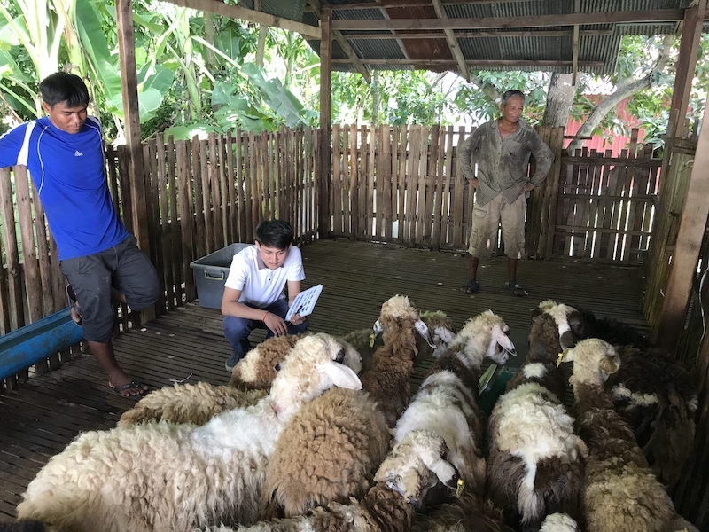
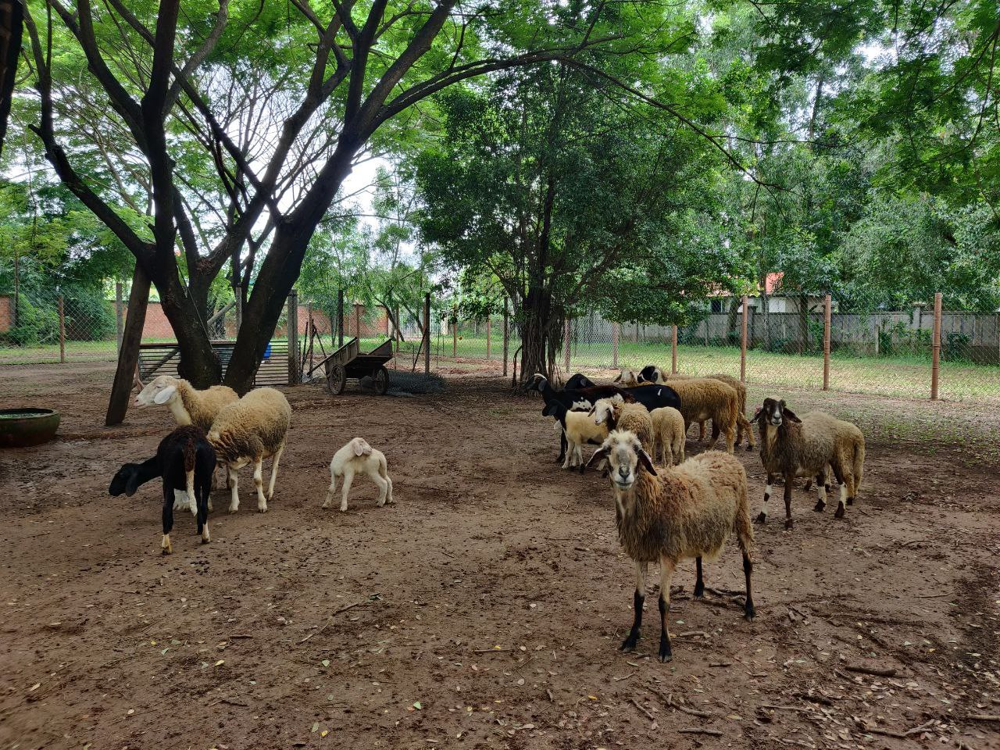

<!-- version 22 Jul 22 -->

```{r setup, include=FALSE}
knitr::opts_chunk$set(echo = F,
                      message = F,
                      collapse = T,
                      warning = F,
                      tidy = T,
                      comment = F,
                      fig.align = 'center'
											)
#rm(list = ls())
```

```{css}
#header p {
	text-align: center;
}

#header p:hover, h2:hover, h3:hover {
	color: red;
	cursor: pointer;
}

.leaflet {
    margin: auto;
}

.table-hover > tbody > tr:hover { 
  background-color: #f4f442;
}

.leaflet {
	border-radius:8px;
}

body {
	text-align: justify;
}

img {
	border-radius: 8px;
	margin-right: 8px;
	
}

img:hover {
  box-shadow: 0 0 4px 2px rgba(0, 140, 186, 0.5);
}


.end_report {
	text-align: right;
}

```

## 1. Introduction

### 1.1. Objectives

-   Demonstrate Central Media Making Laboratory (CMML) activities
-   Define CMML critical needs and inform management
-   Overview of CMML raw material procurement
-   Understand customer request and organize media production as well as media delivery

--\> Data of media production, distribution and raw materials were extracted from the Central Media Making Laboratory Management System ([CMMLMS](https://cmmlms.voozanoo.net)) database in comma separated value and imported to the R programming language for cleaning and analysis.

### 1.2. Background

The Diagnostic Microbiology Development Program ([DMDP](https://www.dmdp.org)) has been working with the University of Health Sciences ([UHS](https://www.uhs.edu.kh)) in Phnom Penh, Cambodia since 2011 to provide a sustainable source of quality-controlled media such as blood culture broth bottles, agar plates, and media for identification of bacteriological agents. The media is produced and quality controlled by following guidelines for Assuring Quality of Medical Microbiology Culture Media; Clinical and Laboratory Standards Institute and Australian Society for Microbiology 2^nd^ edition to guide development of CMML standard operating procedures and processes. In 2017, DMDP supported the expansion and renovation of premises, purchase and installation of equipment and long-term on-site technical mentoring. Care and bleeding of sheep ensured access to a sustainable source of sheep blood. Since February 2019, CMML has held ISO certification (ISO 9001:2015). The media products were included in the Ministry of Health Essential Medicines List and more than 20 customers purchased media for their routine clinical bacteriology laboratory set up.

<!----------------------------Raw Materials--------------------------------->

## 2. Raw materials

Data extracted on: [`r format(r_date,"%d %b %Y")`]{style="color:red"}\
Raw materials are grouped by item name regardless of different brands to discover the current stock. Rows highlighted in pink indicate that the item's quantity is lower than the threshold.\
Note: raw data might not be up to date. It depends on the day data is extracted from CMMLMS in the item batch listing session.\
\newpage

```{r Raw materials available in stock, results='asis'}
r_da <- r_data %>%
  filter(!is.na(threshold),
         !is.na(name)
         ) %>% 
  group_by(name, unit.y, category, threshold) %>% 
  summarise(instock = round_half_up(sum(as.numeric(remaining_stock_item_batch), na.rm = T))) %>% 
  select(Category = category, 'Item name' = name, 'Qnt instock' = instock, Threshold = threshold, 'In unit' = unit.y) %>%
  arrange('Item name', Category)

# short order to the last row
  r_da <- rbind(r_da %>% filter(Category != "Other"),r_da %>% filter(Category == "Other"))
  
# add to table and formate
  r_da %>% 
  kable(align = c('l','l','c','c',"l"), format.args = list(big.mark = ",")) %>%
  kable_styling(fixed_thead = T, bootstrap_options = c("bordered","condensed", "striped", "hover","responsive")) %>%
  row_spec(0, background = "#E09B43", color = "white", align = "c") %>% 
  row_spec(which(r_da$`Qnt instock` < r_da$Threshold, r_da$Threshold > 0) , bold = T, background = "#FFE4E1", color = "black") %>% 
  collapse_rows(columns = 1, valign = "top") %>% 
  scroll_box(width = "100%", height = "800px")
```

<br> \newpage Dehydrated media powder is critical for the production of culture media. Based on media production data, we express dehydrated media in grams to determine the consumption.

```{r Raw material consumption based on production}
p_data <- data %>% 
  filter(preparation_date >= date[1, 2]) %>% 
  distinct(batch_number,.keep_all = T) %>% # remove duplicated..................
  group_by(powder_name) %>% 
  summarise(total = round_half_up(sum(powder_kg,na.rm = T)*1000)) 

p_data %>% 
  ggplot(aes(reorder(powder_name,-total),total,fill = powder_name)) +
  geom_bar(stat = "identity") + 
  geom_text(aes(label = format(total, big.mark = ",")), hjust = -0.01, size = 3) +
  coord_flip() +
  theme_bw() +
  theme(legend.position = "non", 
        panel.grid = element_blank(),
        axis.text = element_text(colour = "black"), 
        plot.title = element_text(color = "blue",face = "bold",hjust = 0.5),
        axis.title = element_text(color = "BlueViolet")) +
  scale_y_continuous(expand =  expansion(mult = c(.01, 0.10)), 
                     label = scales::comma
  									 ) +
  labs(y = "Quantity (gram)", 
       x = "Dehydrated media", 
       title = "Dehydrated media consumption\n from media production data")

```

**Abbreviation**: *ATM-Amies Transport Medium, BAB infusion-Blood agar based infusion, BAB2-Blood agar based No2, BHI-Brain Heart Infusion, CIT-Simmons Citrate agar, CLED-Cystine Lactose Electrolyte Deficient agar, GC-GC agar, HEK-Hektoen Enteric agar, KIA-Kligler Iron agar, LIA-Lysine Iron agar, MAC-MacConkey agar, MHII-Mueller Hinton agar II, MSA- Mannitol Salt agar, MTM-Modified Thayer-Martin agar, SIM-Sulfide Indole Motility, TCBS-Thiosulfate Citrate Bile Salts Sucrose agar, TSA-Tryptic Soy agar, TSB-Tryptic Soy Broth, Urea-Urea agar*

<!-------------------Sheep Care------------------------------->

\newpage

## 3. Sheep Care

Data extracted on: [`r format(Sys.Date(),"%d %b %Y")`]{style="color:red"}

Sheep blood is a vital supplement to support bacterial growth and to visualize hemolysis patterns. To sustain sheep blood supply for CMML, agreements are established with Resource Development International Cambodia (RDIC) and other sheep farm(s) for care, feeding, bleeding and housing of the sheep. Detail of [sheep inventory](https://docs.google.com/spreadsheets/d/1ixEijAjGdYoIG56HROUVuN9z_DXIak1A6achRbUAzFM/edit#gid=1304838431)

<center>

{width="310"} {width="308"}

</center>

```{r sheep inventory, fig.width=5,fig.height=4}

# sheep inventory
sheep_inventory %>% 
	ggplot(aes(farm, fill = sex)) + 
	geom_bar() +
	geom_text(aes(label = ..count..),stat = 'count', 
						position = position_stack(vjust = 0.5)) +
	labs(x = "Farm",
			 y = "count (head)",
			 title = "Sheep inventory",
			 subtitle = paste0("(n= ",nrow(sheep_inventory),")"),
			 caption = paste0("Including ",sheep_inventory %>% filter(sheep_id_microchip_no == "lamb") %>% count(), " lamb at EPR")) +
	theme_bw() +
	theme(plot.title = element_text(color = "blue",face = "bold", hjust = 0.5),
				plot.subtitle = element_text(color = "blue", hjust = 0.5),
				axis.title = element_text(color = "BlueViolet"),
				axis.text = element_text(colour = "black"),
				plot.caption = element_text(face = "italic"))
  
```

\newpage

```{r monthly sheep blood collection}

# sheep blood collection
sblood <- sheep_blood %>% 
	filter(collection_date >= date[1,2],
				 collection_date <= date[2,2],
				 sterility_test != "Fail") %>% 
	mutate(month = format(collection_date, "%b")) %>% 
	group_by(month) %>% 
	summarise(n = sum(blood_volume_ml))

sblood %>% 
	ggplot(aes(factor(month, levels = month.abb), n, fill = month)) + 
	geom_bar(stat = "identity") +
	geom_text(aes(label = format(n, big.mark = ",")), vjust = -0.5, size = 3) +
	scale_y_continuous(label = scales::comma, expand = expansion(mult = c(.01, 0.10))) +
	labs(x = "Month", 
			 y = "Volume (ml)", 
			 title = "Monthly Sheep Blood collection",
			 subtitle = paste0("(n= ", format(sum(sblood$n), big.mark = ",") , " ml)"),
			 caption = paste0(sheep_blood %>% filter(sterility_test == "Fail") %>% summarise(format(sum(blood_volume_ml, na.rm = T), big.mark = ","))," ml of sheep blood contaminated and excluded")) +
	theme_bw() +
	theme(legend.position = "non",
				axis.text = element_text(color = "black"),
				plot.title = element_text(color = "blue", face = "bold", hjust = 0.5),
				plot.subtitle = element_text(color = "blue", hjust = 0.5),
				axis.title = element_text(color = "BlueViolet"),
				plot.caption = element_text(face = "italic"))
```

Frequency of sheep blood collection from [`r format(date[1,2], "%d %b")` - `r format(max(sheep_blood$collection_date),"%d %b %Y")`]{style="color:red"}:

```{r sheep collection blood}
sheep_blood %>% 
	filter(!is.na(sheep_id_microchip_no)) %>% 
	select(collection_date, sheep_id_microchip_no, sex, farm) %>% 
	group_by(sheep_id_microchip_no, sex, farm) %>% count() %>% 
	arrange(-n) %>% 
	rename('Sheep ID' = sheep_id_microchip_no, 'Sex' = sex, 'Farm' = farm, 'Frequency' = n) %>% 
	#mutate_all(~replace(., is.na(.), 0)) %>% 
	kable(align = c("l","c","c","c")) %>% 
  kable_styling(fixed_thead = T, full_width = T, bootstrap_options = c("bordered","condensed", "striped", "hover","responsive")) %>% 
  row_spec(0, background = "#CCCCFF")
	
```

\newpage

CMML performs quality control of sheep blood by monitoring packed cell volume (PCV). The acceptable range of PCV for sheep is between 24 to 45. Below is the summary of sheep with PCV out of range, not suitable for blood collection: <!-- year of 2022 -->

```{r sheep care pcv}
sheep_care %>% 
	select(sheep_id_microchip_no, care_date, farm, pcv_24_45_percent) %>%
	filter(pcv_24_45_percent < 24 | pcv_24_45_percent > 45) %>% 
	group_by(sheep_id_microchip_no) %>% 
	arrange(sheep_id_microchip_no, care_date) %>% 
	mutate(care_date = format(care_date, "%d %b %Y")) %>% 
	rename("Sheep ID" = sheep_id_microchip_no, "Collection Date" = care_date, Farm = farm, PCV = pcv_24_45_percent) %>% 
	kable(align = c("l","c","c","c")) %>% 
  kable_styling(fixed_thead = T, full_width = T, bootstrap_options = c("bordered","condensed", "striped", "hover","responsive")) %>% 
  row_spec(0,background = "#CCCCDF")
```

<!------------------------------------IQC------------------------------------------>

\newpage

## 4. Media Internal Quality Control

Date: [`r format(date[1,2], "%d %b")` - `r format(max(iqc$qc_date),"%d %b %Y")`]{style="color:red"}\
CMML performs quality control for all batches of media before delivery to customers. The table below summarizes quality control results. Note: experimental media are excluded from this table.

```{r IQC}
iqc <- iqc %>% 
  filter(is.na(exp)) %>%
  group_by(name_media, qc_result) %>% 
	count() %>% 
  pivot_wider(names_from = qc_result, values_from = n) %>% 
  arrange(name_media) %>% 
	mutate(no = ifelse("no" %in% names(.), no, 0)) %>%
  adorn_totals(c("row","col")) %>% 
  mutate_all(~replace(., is.na(.), 0)) %>% 
  mutate(name_media = recode(name_media, 
                               "Cystine Lactose Electrolyte Deficient Agar" = "Cystine Lactose                                Electrolyte Deficient Agar (CLED)",
                               "Thiosulfate Citrate Bile Salts Sucrose Agar" = "Thiosulfate                                   Citrate Bile Salts Sucrose Agar (TCBS)"))

# filter column total to calculate percentage
iqc_total <- iqc %>% 
    filter(name_media == "Total") %>% 
    mutate(yes = paste(yes,"(", round(yes/Total * 100,  1) ,"%)"),
           no = paste(no,"(", round(no/Total * 100,  1) ,"%)")) 

# combine file
iqc <- iqc %>% 
filter(name_media != "Total") %>% 
  rbind(.,iqc_total) %>% 
  rename("Media name" = name_media,"Pass" = yes, "Fail" = no)

# show in table
iqc %>% 
  kable(align = c('l','c','c','c')) %>% 
  kable_styling(fixed_thead = T, full_width = T, bootstrap_options = c("bordered","condensed", "striped", "hover","responsive")) %>% 
  row_spec(0,background = "#82E0AA") %>% 
  row_spec(which(iqc$Fail > 0) , bold = T, background = "#FFE4E1", color = "black")
  
```

<!-------------------------------Production------------------------------------>

\newpage

## 5. Media production

We compute media production data from [1 Jan - `r format(as.Date(ifelse(max(data$preparation_date, na.rm=T) <= date[2,2], max(data$preparation_date, na.rm=T), date[2,2]), origin = "1970-01-01"),"%d %b %Y")`]{style="color:red"}

```{r cumulative media production, fig.width=8}
p_data <- data %>% 
  filter(preparation_date >= date[1, 2], preparation_date < date[2, 2]) %>% 
  distinct(batch_number,.keep_all = T) %>% # remove duplicated..................
  group_by(media_name) %>% 
  summarise(n = sum(p_quantity)) %>% 
	arrange(-n)

ymax <- p_data %>% 
  top_n(n = 1)

p_data %>% 
  ggplot(aes(reorder(media_name, -n), n, fill = media_name)) +
  geom_bar(stat = "identity") +
  geom_text(aes(label = format(n, big.mark = ",")), size = 3, hjust = -0.01) +
  coord_flip() +
  theme_bw() +
  theme(legend.position = "non", 
        panel.grid = element_blank(),
        axis.text = element_text(colour = "black"), 
        plot.title = element_text(color = "blue", face = "bold", hjust = 0.5),
        plot.subtitle = element_text(color = "blue", hjust = 0.5),
        axis.title = element_text(color = "BlueViolet")) +
  scale_y_continuous(expand = expansion(mult = c(.01, 0.10))) +
  labs(y = "Quantity", 
       x = "Media name", 
       title = "Cumulative Media Production",
       subtitle = paste0("(n = ",format(sum(p_data$n), big.mark = ",")," unit)")) 
  
```

<!-- Monthly production by month by type -->

\newpage

```{r monthly production by month by type}

p_data <- data %>% 
  filter(preparation_date >= date[1, 2], preparation_date < date[2, 2]) %>% 
  distinct(batch_number,media_name,media_type, .keep_all = T) %>%
  group_by(p_month, media_type) %>% 
  summarise(n = sum(p_quantity),.groups = "drop") 

p_data %>% # plot data...........
  ggplot(aes(p_month, n, fill = media_type)) +
  geom_bar(stat = "identity" ) +
  facet_wrap(~ reorder(media_type, -n), ncol = 2) +
  geom_text(aes(label = format(n, big.mark = ",")), size = 3, vjust = -0.5) +
  theme_bw() +
  theme(strip.text = element_text(face = "bold"),
  			strip.background = element_rect(fill = "lightyellow"),
        legend.position = "non", 
        axis.text = element_text(colour = "black"),
        plot.title = element_text(hjust = 0.5,face = "bold",colour = "blue"),
        plot.subtitle = element_text(hjust = 0.5, color = "blue"), 
        axis.title = element_text(color = "BlueViolet")) +
  scale_y_continuous(expand = expansion(mult = c(.01, 0.10)), labels = scales::comma) +
  labs(x = "Month",
       y = "Quantity", 
       title = "Media Production by Month by Type", 
       subtitle = paste0("(n = ", format(sum(p_data$n), big.mark = ",")," unit)"))  
```

<!-------------------------------Distribution---------------------------------->

\newpage

## 6. Media distribution

Media distribution is calculated from [1 Jan - `r format(as.Date(ifelse(max(data$delivery_date, na.rm = T) <= date[4,2], max(data$delivery_date, na.rm = T), date[4,2]), origin = "1970-01-01"),"%d %b %Y")`]{style="color:red"}

The bubble in the map shows the different sites of customers orders and the size of the bubble indicates the quantity in units. In cooperation with interactive maps, you can zoom in and click on a map to see data plotting.

<!-------- adding map ------------>

<center>

```{r adding map to show customer location}
tmap_options(max.categories = 40)
tmap_mode("view")
tm_basemap("Esri.WorldTopoMap") +
tm_shape(map) +
  tm_polygons(col = "#AED6F1", alpha = 0.5) +
  tm_shape(m_data) +
  tm_bubbles("Total", col = "customer", legend.col.show = F,
  					 popup.vars = c("Purchased(unit) " = "Total")) +
  tm_view(set.view = c(104.8879197, 12.6687923, 7.4))
```

</center>

<br>

```{r cumulative media distribution, fig.width=8}
d_data <- data %>% 
	filter(delivery_date >= date[3, 2], delivery_date < date[4, 2]) %>% 
  group_by(media_name) %>% 
  summarise(n = sum(d_quantity),.groups = "drop") %>% 
  arrange(-n) 

d_data %>% 
  ggplot(aes(reorder(media_name, -n), n, fill = media_name)) +
  geom_bar(stat = "identity") +
  geom_text(aes(label = format(n, big.mark = ",")), size = 3, hjust = -0.01) +
  coord_flip() +
  theme_bw() +
  theme(legend.position = "non", 
        panel.grid = element_blank(), 
        axis.text = element_text(colour = "black"), 
        plot.title = element_text(color = "blue",face = "bold",hjust = 0.5),
        plot.subtitle = element_text(color = "blue",hjust = 0.5), 
        axis.title = element_text(color = "BlueViolet")) +
  scale_y_continuous(expand = expansion(mult = c(.01, 0.10))) +
  labs(y = "Quanity", 
       x = "Media name", 
       title = "Cumulative Media Distribution", 
       subtitle = paste0("(n = ",format(sum(d_data$n,na.rm = T), big.mark = ",")," unit)")) 

```

<!-- Monthly distribution Not sure it is useful information?-->

\newpage

```{r monthly distribution}
d_data <- data %>%
	filter(delivery_date >= date[3, 2], delivery_date < date[4, 2]) %>% 
  group_by(d_month, media_type) %>%
  summarise(n = sum(d_quantity),.groups = "drop") 

d_data %>% # plot data...........
  ggplot(aes(d_month, n, fill = media_type)) +
  geom_bar(stat = "identity", position = "dodge", show.legend = F) +
	facet_wrap(~ reorder(media_type, -n), ncol = 2) +
  geom_text(aes(label = format(n, big.mark = ",")),
            size = 3, vjust = -0.5, 
            position = position_dodge(width = 1),
  					 show.legend = F) +
 scale_y_continuous(expand = expansion(mult = c(.01, 0.10)),labels = scales::comma) +
  labs(x = "Month",
       y = "Quantity",
       title = "Media Distribution by Month by Type",
       subtitle = paste0("(n =  ",format(sum(d_data$n,na.rm = T),big.mark = ",")," unit)")) +
    theme_bw() +
     theme(strip.text = element_text(face = "bold"),
     			strip.background = element_rect(fill = "lightyellow"),
        axis.text = element_text(colour = "black"),
        plot.title = element_text(color = "blue",face = "bold", hjust = 0.5),
        plot.subtitle = element_text(color = "blue",hjust = 0.5),
        axis.title = element_text(color = "BlueViolet")) 
 

```

<!-- Customer in table -->

\newpage

```{r media distributes to customer, results="asis"}
d_data <- data %>% 
  filter(delivery_date >= date[3, 2], delivery_date < date[4, 2]) %>% 
  select(customer, d_month, d_quantity, media_type) %>% 
  group_by(customer, d_month) %>% 
  summarise(n = sum(d_quantity), .groups = "drop") %>% 
  arrange(d_month) %>%
  pivot_wider(names_from = d_month, values_from = n) %>% 
  mutate_all(., ~replace(., is.na(.), 0)) %>% 
  mutate(Total = rowSums(across(where(is.numeric)))) %>% 
  arrange(-Total) %>% 
  rename('Customer Name' = customer)

d_data %>% 
   mutate_if(is.numeric, format, big.mark = ",") %>% 
   kable(align = c('l','c','c','c','c','c','c','c','c','c','c','c','c')) %>% 
   kable_styling(fixed_thead = T, full_width = T, bootstrap_options = c("bordered","condensed", "striped", "hover","responsive")) %>% 
  row_spec(0,background = "#CCCCFF") %>% 
  footnote(general_title = "","NPHL: National Public Health Laboratory,
               BOM: Blue Opportunity Medical Co.,Ltd.,
               NHealth Laboratory: Royal Phnom Penh hospital's laboratory,
  						 DDL: Diagnostic and Detection Laboratory,
  				 KSFH: Khmer Soviet Friendship Hospital, 
  				 SHCH: Sihanouk Hospital Center of Hope")

```

\newpage

<!-- Ashdown's media -->

```{r Ahdown media distribution, fig.height=8, fig.width= 10}
d_data <- data %>% 
	filter(delivery_date >= date[3, 2], delivery_date < date[4, 2]) %>% 
	select(media_name, customer, d_quantity, d_month) %>% 
	filter(media_name == "Ashdown's Agar") %>% 
	mutate(customer_name = recode(customer, 
																"Khmer Soviet Friendship Hospital" = "KSFH",
																"Central Media Making Laboratory" = "CMML")) %>% 
	group_by(d_month, customer) %>% 
	summarise(d_quantity = sum(d_quantity)) 

d_data %>% 
	ggplot(aes(d_month, d_quantity, fill = customer)) +
	geom_bar(stat = "identity", show.legend = F) + 
	geom_text(aes(label = d_quantity), size = 3, vjust = -0.5) +
	facet_wrap(~ customer, ncol = 3) + 
	labs(title = "Ashdown's media distributed", 
			 subtitle = paste0("(n =  ",format(sum(d_data$d_quantity),big.mark = ",")," unit)"),
			 x = "Month", 
			 y = "Quanitity") +
	scale_y_continuous(expand = expansion(mult = c(.01, 0.10)),labels = scales::comma) +
	theme_bw() +
  theme(strip.text = element_text(face = "bold"),
        axis.text = element_text(colour = "black"),
        plot.title = element_text(color = "blue",face = "bold", hjust = 0.5),
        plot.subtitle = element_text(color = "blue", hjust = 0.5),
  			axis.title = element_text(color = "BlueViolet"))

```

\newpage

From the start of the year, CMML distributed quality controlled media to different groups of customers around the country. Customers are classified in four groups:\
1. Government laboratory supported by DMDP: Siem Reap, Battambang, Kampong Cham, Takeo and National Public Health Laboratory. Note: from May to September 2022, laboratories start to pay for bacteriological culture media from 20% and increase gradually to 100%.\
2. Government laboratory supported by project: e.g AMR surveillance, stool project in Battambang\
3. Government laboratory purchased: interestingly with an increase in orders from government laboratories e.g Khmer Soviet Friendship Hospital, Cambodia China Friendship Hospital (Kossamak), National Pediatric Hospital,...\
4. Private laboratory purchased: e.g Royal Phnom Penh hospital department of laboratory, International Laboratory, Dynamic pharma.... 5. Supplier purchased: supplier purchase media from CMML and sell to laboratories. e.g BOM, Dynamic...

```{r media distribute by customer type and media type, fig.width=8}
d_data <- data %>% 
	filter(delivery_date >= date[3, 2], delivery_date < date[4, 2]) %>% 
	select(media_type,media_name, customer, group, d_quantity,cost) %>% 
	group_by(group, media_type) %>% 
	summarise(n = sum(d_quantity,na.rm = T),.groups = "keep") %>%
	ungroup() %>% 
	arrange(-n)
	
d_data %>% 
		ggplot(aes(fct_inorder(group), n, fill = media_type)) +
geom_bar(stat = "identity") +
	geom_text(aes(label = format(n, big.mark = ",")), hjust = -0.01, size = 3) + 
	facet_wrap(~media_type, scales = "free_x") + 
	coord_flip() + 
	labs(x = "",
			 y = "Quantity",
			 title = "Media Distubution by Customer Type and Media Type",
			 subtitle = paste0("(n =  ",format(sum(d_data$n),big.mark = ",")," unit)")) +
	scale_y_continuous(labels = scales::comma, expand = expansion(mult = c(.01, 0.17))) +
	theme_bw() +
	theme(legend.position = "non",
				strip.text = element_text(face = "bold"),
				axis.text = element_text(colour = "black"),
				plot.title = element_text(color = "blue",face = "bold",hjust = 0.5),
				plot.subtitle = element_text(color = "blue", hjust = 0.5),
				axis.title = element_text(color = "BlueViolet"))


```

\newpage

<!-- distribute media base on type of customer -->

```{r proportion of media distributed to customer}
d_data <- data %>% 
	filter(delivery_date >= date[3, 2], delivery_date < date[4, 2]) %>% 
	select(media_name, customer_name, group, d_quantity,cost) %>% 
	group_by(group) %>%
	summarise(n = sum(cost,na.rm = T),.groups = "keep") %>%
	ungroup() %>% 
	mutate(percentage = round_half_up(n/sum(n)*100)) %>% 
	arrange(-percentage) %>% 
	mutate(group = factor(group, levels = group))

d_data %>% 
	ggplot(aes(x = "",
						 y = n, 
						 fill =  group)) +
	geom_bar(stat = "identity") +
	coord_polar("y", start = 3.5, direction = -1) + 
	theme_void() +
	geom_text_repel(aes(x = 1.1,
											label = paste0(format(round_half_up(n), big.mark = ",")," $"," (",percentage,"%)")),
									position = position_stack(vjust = 0.5)) +
	theme(plot.title = element_text(color = "blue",face = "bold",hjust = 0.5),
				plot.subtitle = element_text(color = "blue",hjust = 0.5)) + 
	labs(title = "Income from Media Distribution", 
			 subtitle = paste0("Income = (", format( round_half_up(sum(d_data$n,na.rm = T)), big.mark = ",")," USD)"),
			 fill = "Customer type")
```

\newpage

We summarized quantity and cost in USD for the DMDP supported laboratory by month for routine diagnostic testing.\
<!-- DMDP supported lab with type of media delivery monthly with quantity and cost -->

```{r DMDP supported lab}
d_data <- data %>% 
  select(customer, delivery_date, d_month, media_type, d_quantity, cost) %>% 
  filter(delivery_date >= date[3, 2], delivery_date < date[4, 2], customer %in% c("Siem Reap", "Battambang", "Takeo", "Kampong Cham", "NPHL")) %>% 
  group_by(d_month,customer,media_type) %>% 
  summarise(total = sum(d_quantity, na.rm = T),
            cost = sum(cost,na.rm = T)) %>% 
  arrange(d_month) %>% 
	mutate(Qnt_cost = str_glue("{total} ({round_half_up(cost)}\\$)")) %>% 
  select(-total,-cost) %>% 
  pivot_wider(names_from = d_month, values_from = Qnt_cost) %>% 
  arrange(customer, media_type) %>%
  rename("Cusomter Name" = customer, 
         "Media Type" = media_type) %>% 
  mutate_all(~replace(., is.na(.), 0))

d_data %>% 
   mutate_if(is.numeric, format, big.mark = ",") %>% 
   kable(align = c('l','c','c','c','c','c','c','c','c','c','c','c','c')) %>% 
   collapse_rows(1, valign = "middle") %>% 
   kable_styling(fixed_thead = T, 
   							full_width = T, 
 
   							bootstrap_options = c("bordered","condensed", "striped", "hover","responsive")) %>% 
  row_spec(0, background = "#C6E2FF", extra_css = 'vertical-align: middle !important;') %>% 
  footnote(general_title = "","NPHL: routine sample") 
```

<!-- ending report -->

::: end_report
Reported by CMML <br><br><br> `r format(Sys.Date(),"%d-%b-%Y")`
:::

<!------------------------------------Remove objects------------------------------------->

```{r remove objects}
rm(list = ls())
```
